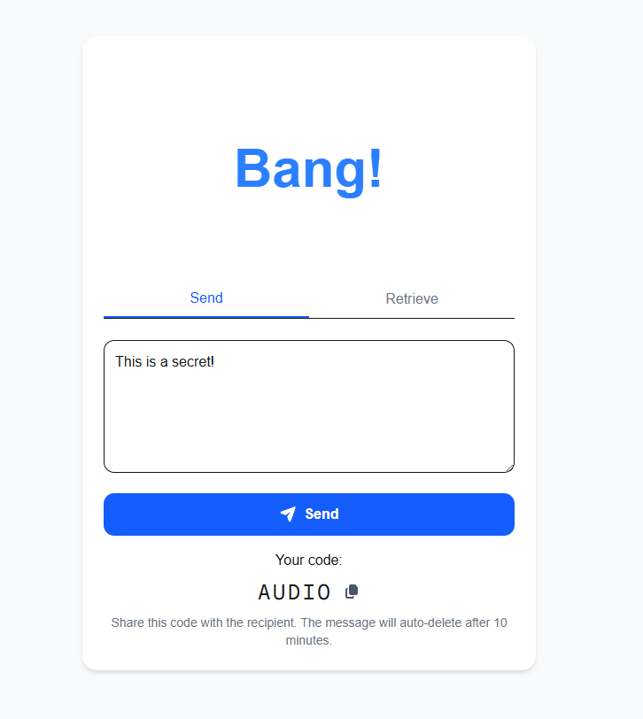
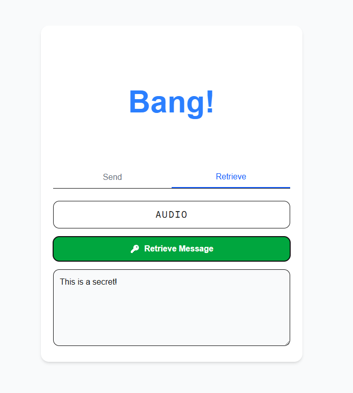

# Bang!

Bang! is a 'one-shot' messaging platform designed to be as simple as possible to allow sharing of text between two participants.

Bang! was born out of a desire to share a simple JSON configuration between my work PC and my home PC. Since I really like keeping those two lives separate, I didn't have Slack installed on my home PC and I hadn't logged into Messenger on my work PC, leading to a frustration over such a menial task.

## Use

* Go to the site
* Paste the text you wish to share into the input text area and click 'Send'
* A 5-lettered word code will be generated for you
* Return to the site and enter the code to reveal the text

Upon using the code and revealing the text, the text will be deleted. Texts also automatically delete after a 10 minute timeout.

